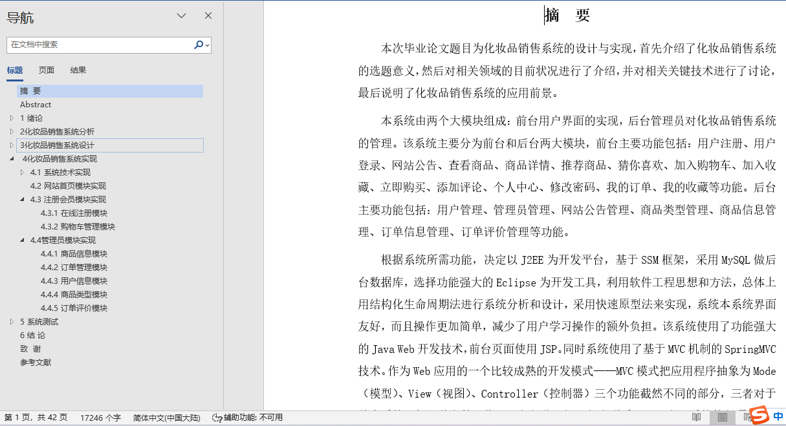

## 基于SSM框架的化妆品商城系统(程序+报告)

- <b>完整代码获取地址：从戎源码网 ([https://armycodes.com/](https://armycodes.com/))</b>
- <b>技术探讨、资料分享，请加QQ群：692619798</b> 
- <b>作者微信：19941326836  QQ：952045282</b> 
- <b>承接计算机毕业设计、Java毕业设计、Python毕业设计、深度学习、机器学习</b>
- <b>选题+开题报告+任务书+程序定制+安装调试+论文+答辩ppt 一条龙服务</b>
- <b>所有选题地址 ([https://github.com/YuLin-Coder/AllProjectCatalog](https://github.com/YuLin-Coder/AllProjectCatalog)) </b>

## 项目介绍
基于SSM框架的化妆品商城系统，本化妆品销售网站主要分为前台和后台两大功能模块，共包含两种角色，分别是：用户、管理员。
其功能如下：

【前台功能】
1. 前台首页：展示化妆品商城的概要信息和推荐商品。
2. 用户注册：新用户可以注册账户以便后续购物和管理订单。
3. 用户登录：已注册的用户可以登录账户进行购物和管理个人信息。
4. 网站公告：发布商城的最新公告和促销活动信息。
5. 查看商品：用户可以浏览商城中的所有商品，并根据分类进行筛选。
6. 商品详情：用户可以查看单个商品的详细信息，包括产品介绍、价格、库存等。
7. 推荐商品：商城根据用户的浏览和购买记录，推荐相似或相关的商品。
8. 猜你喜欢：商城根据用户的兴趣和购买历史，推荐可能感兴趣的商品。
9. 加入购物车：用户可以将商品加入购物车，方便后续批量购买。
10. 加入收藏：用户可以将喜欢的商品加入收藏夹，方便以后查看和购买。
11. 立即购买：用户可以直接购买商品，跳转到结算页面进行支付。
12. 添加评论：用户可以对已购买的商品进行评价，并给予星级评分和文字评价。
13. 个人中心：用户可以查看和修改个人信息、上传头像等。
14. 修改密码：用户可以修改登录密码，保证账户的安全性。
15. 我的订单：用户可以查看自己的订单信息，包括待支付、待发货、待收货、已完成等状态。
16. 我的收藏：用户可以查看和管理自己的收藏夹，包括删除、加入购物车等操作。

【后台功能】
1. 后台系统登录：管理员可以通过后台登录验证身份进入系统管理界面。
2. 用户管理：管理员可以管理用户的账户信息，包括添加、编辑、删除用户账户。
3. 管理员管理：管理员可以对系统中的管理员账户进行管理，包括添加、编辑、删除管理员账户。
4. 网站公告管理：管理员可以发布和管理商城的公告信息，包括添加、编辑、删除公告。
5. 商品类型管理：管理员可以管理商品的分类信息，包括添加、编辑、删除分类。
6. 商品信息管理：管理员可以管理商品的详细信息，包括添加、编辑、删除商品。
7. 订单信息管理：管理员可以查看和管理用户的订单信息，包括发货、退款、取消订单等操作。
8. 订单评价管理：管理员可以查看和管理用户对商品的评价，包括审核、删除评价等操作。

## 项目技术
- 编程语言：Java
- 数据库：MySQL
- 前端技术：JSP、jQuery 、Layui
- 后端技术：Spring、SpringMVC、MyBatis

## 运行环境
- JDK版本：JDK1.8及以上
- 开发工具：IDEA、Ecplise、Myecplise都可以
- 数据库: MySQL5.7及以上

## 运行截图

